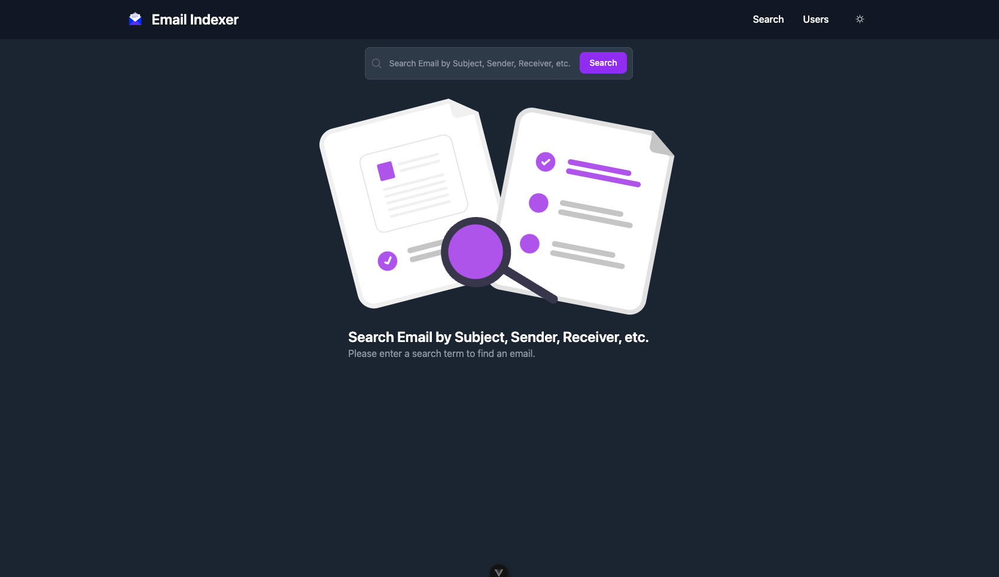
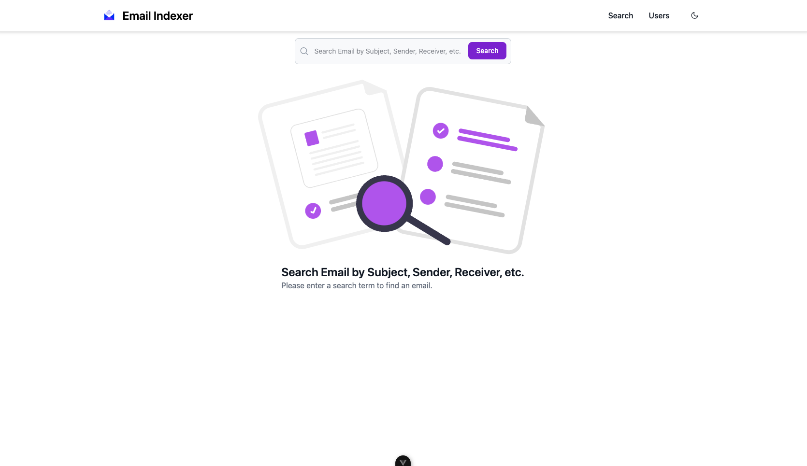
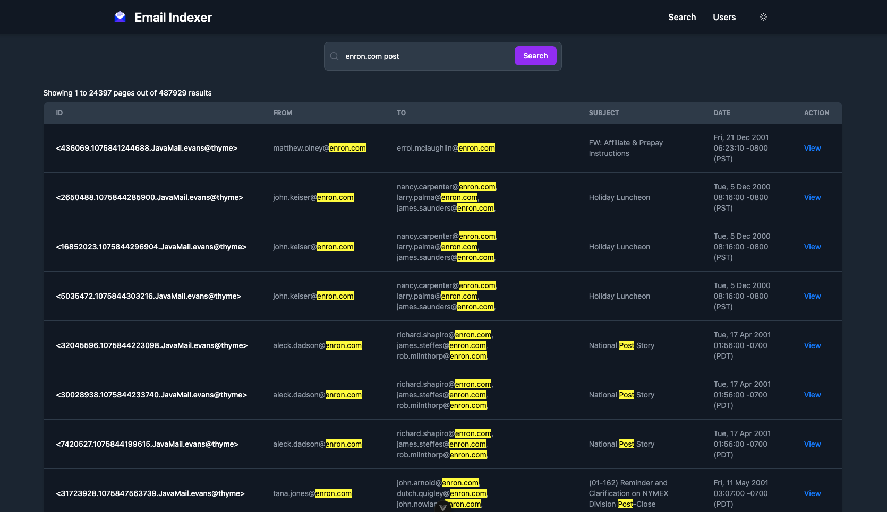
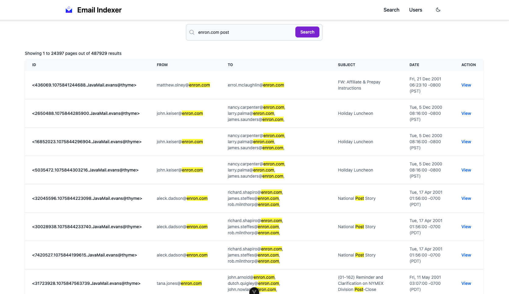
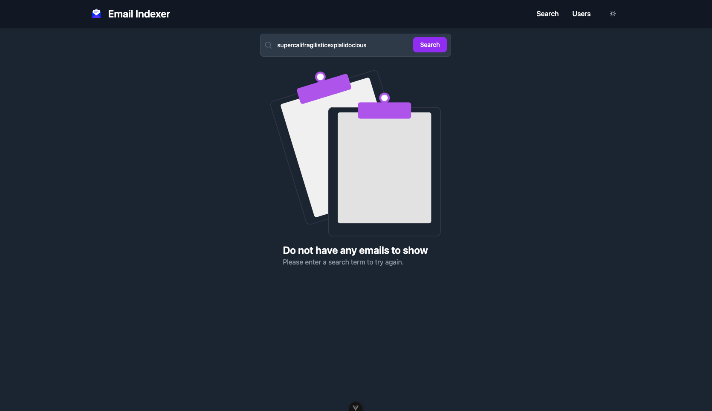

# Email Indexer

## Tech Stack
- [Go 1.23.2](https://tip.golang.org/)
    - [Chi Router](https://github.com/go-chi/chi)
- [Search Engine](https://github.com/zincsearch/zincsearch)
- [Vue 3.5.13](https://vuejs.org/)
- [Docker](https://www.docker.com)
    - [Docker Compose](https://docs.docker.com/compose/)


### APP ENVS
`ZINC_FIRST_ADMIN_USER` Usuario par el administrador de Zinc Search \
`ZINC_FIRST_ADMIN_PASSWORD` Clave par el administrador de Zinc Search \

## BACKEND ENVS
```
cd backend
```
`APP_NAME` Nombre del api para la documentacion \
`VERSION` Version del api para la documentacion \
`HTTP_PORT` Puerto para el api \
`ZINC_SEARCH_API_URL` URL del api de ZincSearch \
`ZINC_SEARCH_AUTH_USER` admin \
`ZINC_SEARCH_AUTH_PASS` password \
`ACCEPTED_DOMAINS` Listado de dominios para las CORS \

## FRONTEND ENVS
```
cd front
```
`VITE_BASE_URL` Url del api de busquedas


## IMAGES
|  |  |
|:------------------------------------------:|:-------------------------------------------:|

|  |  |
|:------------------------------------------:|:-------------------------------------------:|

|  |  |
|:------------------------------------------:|:-------------------------------------------:|


## Build docker image

```shell
docker-compose up -d
```

Down docker 
```shell
docker-compose down
```

#### Testing

```bash
go test -cover ./...
```
```bash
go clean -testcache 
```
```bash
go test  ./... -coverprofile=coverage.out
``` 
```bash
go tool cover -html=coverage.out
```


### Pprof
Captura un perfil de CPU durante 60 segundos
``` 
go tool pprof http://localhost:6060/debug/pprof/profile\?seconds\=60
``` 